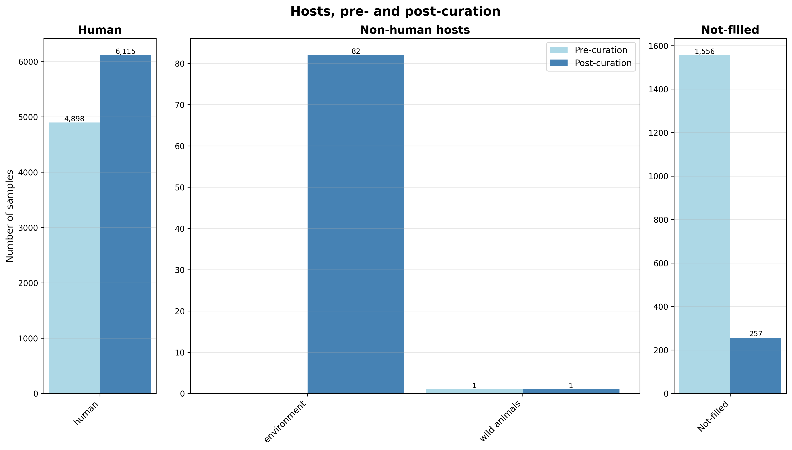
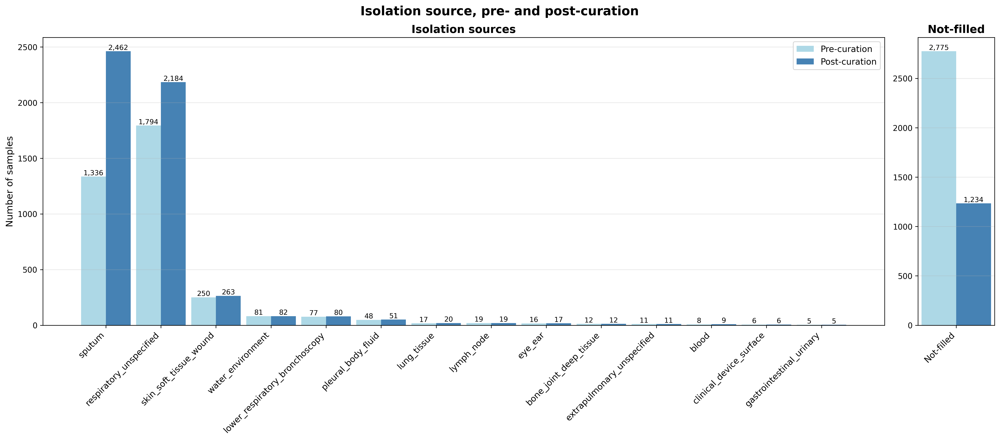
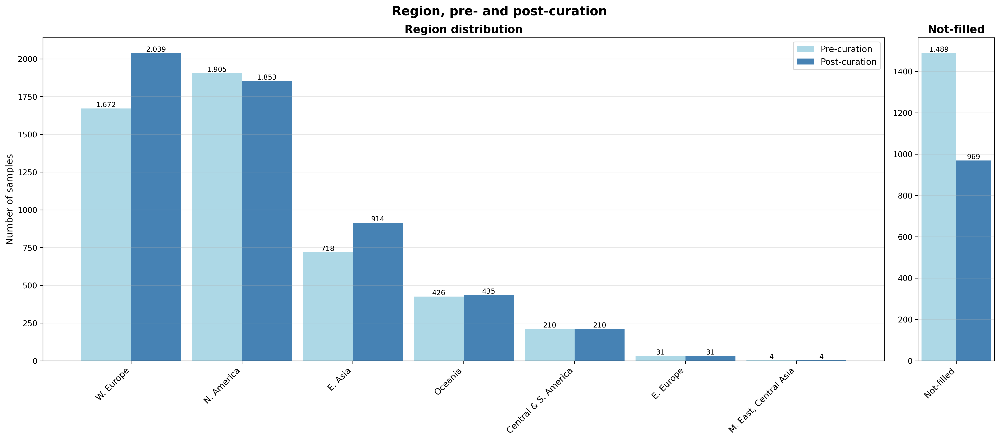
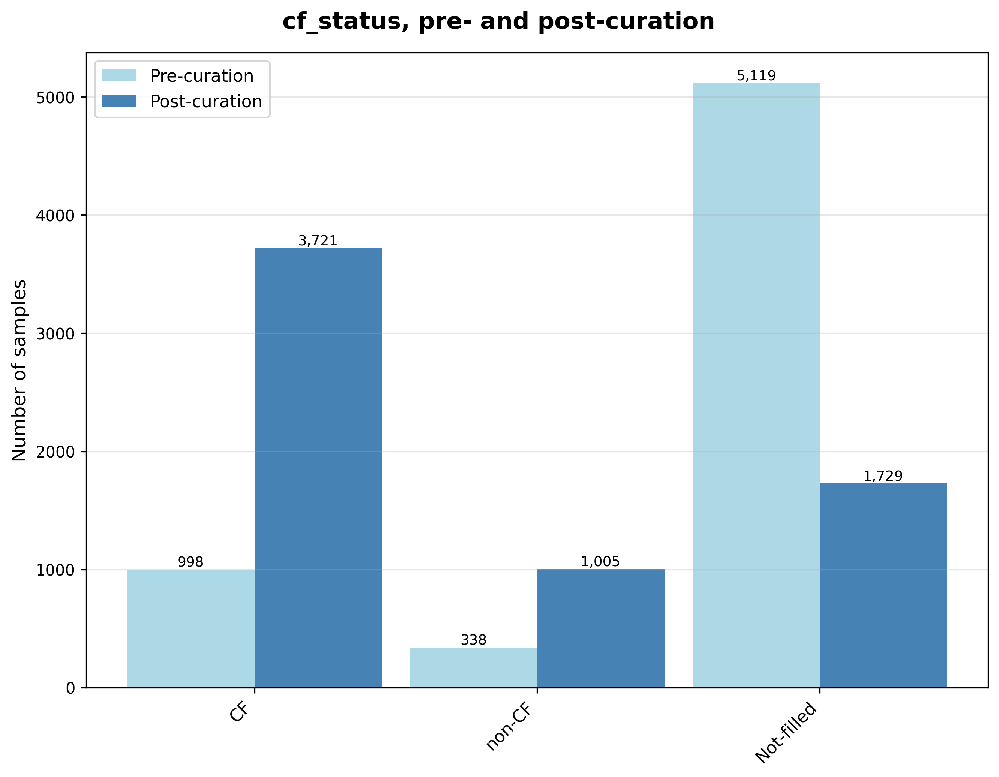
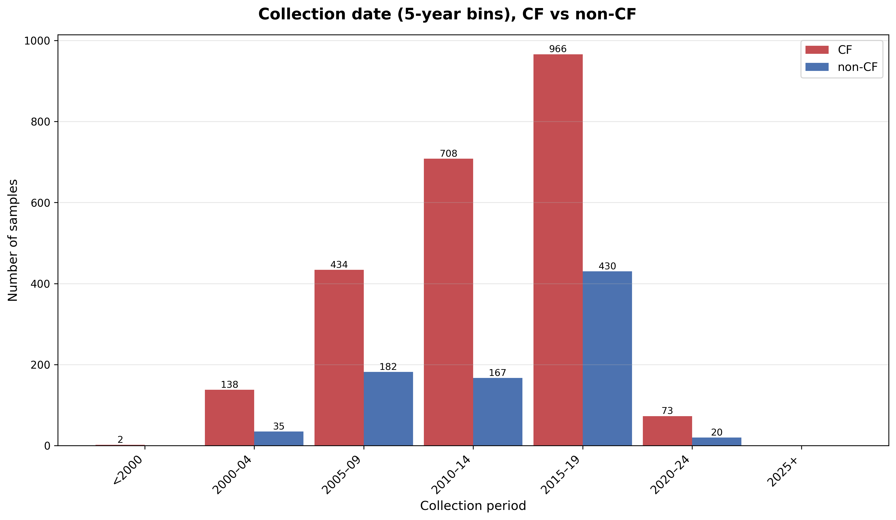
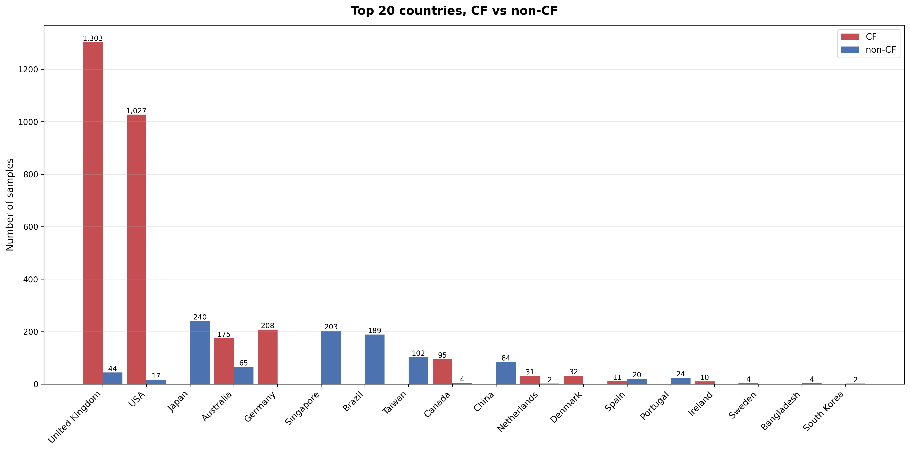
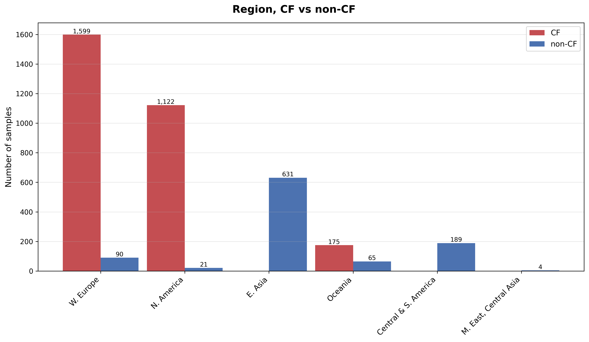
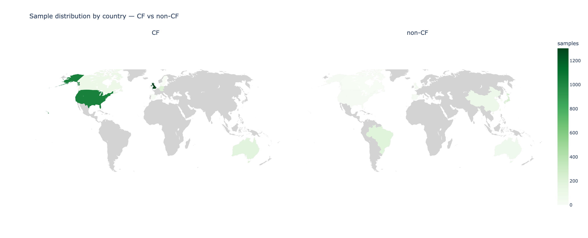

# *Mycobacterium abscessus* — curated metadata overview

Status: **complete** (agentic fill + categorisation + Phase D reconcile, 2026-07-07).
Final table: [`data/curated/metadata_curated_master_final.tsv`](data/curated/metadata_curated_master_final.tsv)
— **6,455 samples × 133 studies × 34 columns**. Figures: [`visualisations/`](visualisations/).

This is the first non-KPSC application of the agentic metadata engine. The headline target is the
species phenotype **CF vs non-CF** (absent from the structured ENA data), alongside the four standard
completeness fields (host, isolation_source, country, collection_date).

---

## 1. Baseline (raw ENA)

The raw ENA export for these 6,455 samples is sparse and noisy: free-text hosts and sources, mixed
country spellings, unparsed dates, and a CF/non-CF phenotype that is only occasionally stated.

| field | raw non-blank | usable* | notes |
|---|---:|---:|---|
| host | 4,951 (76.7%) | 4,899 (75.9%) | strain codes (`CF40`, `BX507`, `CON5`…) leak in; ~all human |
| isolation_source | 4,263 (66.0%) | 3,680 (57.0%) | 583 non-blank but uninformative (`clinical sample`, `other`) |
| country | 4,968 (77.0%) | — | `UK`/`United Kingdom`, `USA`/`USA:TX`, `Holland` all coexist |
| collection_date | 4,475 (69.3%) | ~4,272 | many unparsable / `Not present` placeholders |
| **cf_status** | **1,417 (22.0%)** | 1,336 (20.7%) | phenotype stated for only ~1 in 5 samples |

\* *usable* = maps to a real category (excludes blanks and uninformative `NA` values). The gap between
"non-blank" and "usable" is itself a finding — a large share of populated cells carry no analysable
signal.

---

## 2. New data gathered (agentic curation)

The engine processed the cohort study-by-study, reading the associated papers to (a) **backfill**
whole-study values for missing per-sample fields, (b) **categorise** the two messy fields (host,
isolation_source) into a reviewed M.abs scheme, and (c) **reconcile** cross-column signal (Phase D). No
manual per-value curation was required.

- **Categorisation** — a data-induced, curator-approved scheme: **host** (human / environment / wild
  animals) and **isolation_source** (15 categories: sputum, respiratory_unspecified,
  lower_respiratory_bronchoscopy, lung_tissue, pleural_body_fluid, skin_soft_tissue_wound,
  bone_joint_deep_tissue, lymph_node, eye_ear, blood, gastrointestinal_urinary, clinical_device_surface,
  water_environment, extrapulmonary_unspecified, …). Every distinct value's landing is audited in
  [`data/study_lv_attributes/categorisation/*_reassignment_audit.tsv`](data/study_lv_attributes/categorisation/).
- **Phase D reconcile** — decoded the CF/non-CF signal buried in host strain codes (`CF*`→CF,
  `BX/COPD/NCF/NON*`→non-CF), relabelled 82 water/plumbing isolates `host=environment` (they had been
  defaulted to human), and normalised `cf_status` to a clean binary.
- **Geo/date normalisation** — reused the robust `country`/`region`/`collection_date` parsers, unifying
  spellings (incl. `Holland`→Netherlands) and parsing dates to years.

---

## 3. Reduction in missing values

Completeness after curation (usable category, whole cohort of 6,455):

| field | pre-curation | post-curation | gap closed |
|---|---:|---:|---:|
| host | 4,899 (75.9%) | **6,198 (96.0%)** | +1,299 |
| isolation_source | 3,680 (57.0%) | **5,221 (80.9%)** | +1,541 |
| region (country) | 4,966 (76.9%) | **5,486 (85.0%)** | +520 |
| collection_date (year) | ~4,272 | 4,471 (69.3%) | ~flat (cleaned + modest backfill) |
| **cf_status** | 1,336 (20.7%) | **4,726 (73.2%)** | **+3,390** |

The **cf_status** gain is the standout: the phenotype went from stated for ~1 in 5 samples to ~3 in 4.
See [`visualisations/cf_status_pre_and_post_curation.pdf`](visualisations/cf_status_pre_and_post_curation.pdf).

Not-filled counts (blank + uninformative), pre → post:
host 1,556 → 257 · isolation_source 2,775 → 1,234 · region 1,489 → 969 · cf_status 5,119 → 1,729.

---

## 4. CF vs non-CF phenotype

Post-curation binary: **CF 3,721 (57.6%) · non-CF 1,005 (15.6%) · unresolved 1,729 (26.8%)**
(pre-curation: CF 998, non-CF 338).

### Distribution by region (resolved samples only)

| region | CF | non-CF | total | % non-CF |
|---|---:|---:|---:|---:|
| W. Europe | 1,599 | 90 | 1,689 | 5.3% |
| N. America | 1,122 | 21 | 1,143 | 1.8% |
| E. Asia | 0 | 631 | 631 | 100% |
| Oceania | 175 | 65 | 240 | 27.1% |
| Central & S. America | 0 | 189 | 189 | 100% |
| M. East, Central Asia | 0 | 4 | 4 | 100% |

### The sampling skew (important caveat for any CF-vs-non-CF comparison)

CF vs non-CF status is **strongly confounded with geography**, driven by *where each phenotype was
sampled*, not by biology:

- **CF cohorts come almost entirely from a handful of high-income countries** running CF-patient
  surveillance — the UK (1,303 CF), USA (1,027), Germany (208), Australia (175). These countries report
  overwhelmingly CF and **very few non-CF** cases (sampling bias: the studies were CF-focused).
- **non-CF cases come mostly from countries that report essentially no CF** — Japan (240), Singapore
  (203), Brazil (189), Taiwan (102), China (84). ~87% of all non-CF samples originate in these
  non-CF-reporting countries.
- **But a real, if modest, non-CF signal does exist within the "CF countries":** ~**132 non-CF cases**
  come from otherwise CF-dominant countries — Australia 65, UK 44, USA 17, Canada 4, Netherlands 2.
  These ~130 samples are the ones that allow *within-country* CF-vs-non-CF contrasts that are not fully
  confounded by geography; the cross-country comparison otherwise largely reflects which countries chose
  to sequence which patients.

**Implication:** any CF-vs-non-CF genomic comparison should adjust for country/region (or restrict to
the within-CF-country non-CF cases), because the naive global split is confounded by national sampling
design. See [`visualisations/country_distribution_cf_vs_noncf.pdf`](visualisations/country_distribution_cf_vs_noncf.pdf)
and [`visualisations/region_distribution_cf_vs_noncf.pdf`](visualisations/region_distribution_cf_vs_noncf.pdf),
and the two-panel [`visualisations/country_map_cf_vs_noncf.pdf`](visualisations/country_map_cf_vs_noncf.pdf).

---

## 5. Figures

All in [`visualisations/`](visualisations/) as PDF + PNG (the map also HTML), regenerated by
`report_metadata.py`:

| figure | what it shows |
|---|---|
| `host_category_pre_and_post_curation` | host completeness, pre vs post (environment emerges post-reconcile) |
| `isolation_source_category_pre_and_post_curation` | 15-category source distribution, pre vs post |
| `region_distribution_pre_and_post_curation` | geographic completeness, pre vs post |
| `cf_status_pre_and_post_curation` | Not-filled → filled, split CF / non-CF |
| `collection_date_5yr_bins_cf_vs_noncf` | temporal distribution in 5-yr bins, CF vs non-CF |
| `country_distribution_cf_vs_noncf` | top-20 countries, CF vs non-CF (shows the skew) |
| `region_distribution_cf_vs_noncf` | regions, CF vs non-CF |
| `country_map_cf_vs_noncf` | two-panel world choropleth, CF | non-CF |

---

## 6. Reproduce

```bash
cd ~/developer/BacHGT
# figures (fast, no LLM):
uv run python src/bac_metadata/bac_agentic_metadata/applications/m_abs/report_metadata.py
```

Provenance: raw base `data/inputs/base_table.csv` → agentic fill master
`data/curated/metadata_curated_master.tsv` → categorisation `categorised_mabs.tsv` → Phase D reconcile
`data/curated/metadata_curated_master_final.tsv` (see the folder `CLAUDE.md` and the engine
`PROGRESS_REPORT.md`). Reconcile rules live in `attributes.yaml` (`categorisation` block); every
reassignment is audited under `data/study_lv_attributes/categorisation/`.

---

## 7. Figures

### 7.1 Host — pre- and post-curation
Environment (82 water/plumbing isolates) emerges only post-curation; Not-filled 1,556 → 257.



### 7.2 Isolation source — pre- and post-curation
15 M.abs categories; respiratory-dominant (sputum + respiratory_unspecified); Not-filled 2,775 → 1,234.



### 7.3 Region — pre- and post-curation
Geographic completeness; Not-filled 1,489 → 969.



### 7.4 cf_status — pre- and post-curation (headline)
Not-filled 5,119 → 1,729; the filled set splits CF 3,721 / non-CF 1,005.



### 7.5 Collection date — 5-year bins, CF vs non-CF
Temporal distribution of resolved-phenotype samples; both classes concentrate in 2005–2019.



### 7.6 Country — CF vs non-CF (the sampling skew)
CF-dominant countries (UK, USA, Germany, Denmark) vs non-CF-dominant (Japan, Singapore, Brazil, Taiwan, China).



### 7.7 Region — CF vs non-CF
The same skew aggregated to region: E. Asia and Central & S. America are ~100% non-CF; N. America and W. Europe are overwhelmingly CF.



### 7.8 World map — CF vs non-CF
Two-panel choropleth of per-country sample counts (shared scale); the CF panel is dominated by the UK/USA, the non-CF panel by East Asia and South America.


